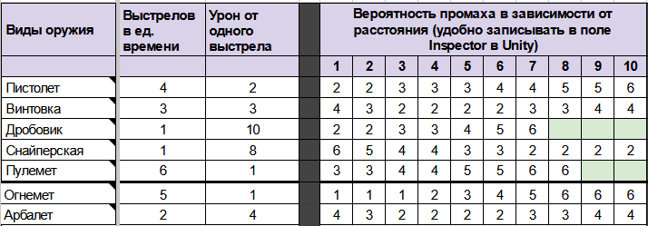
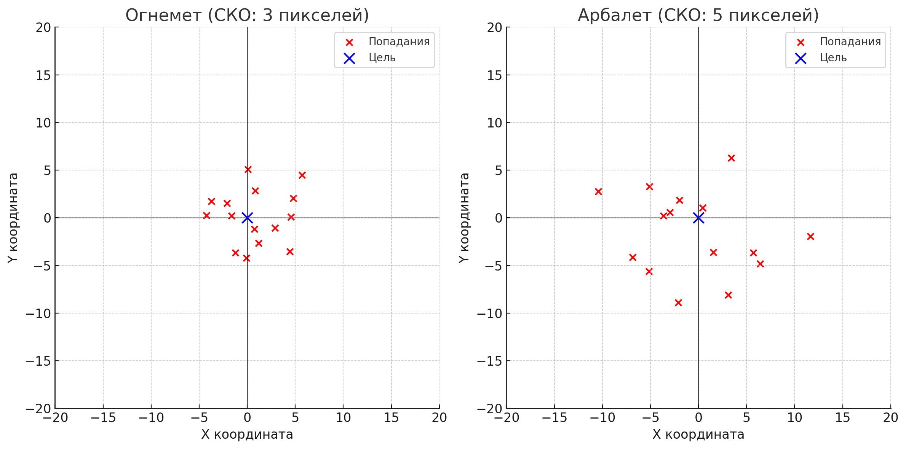
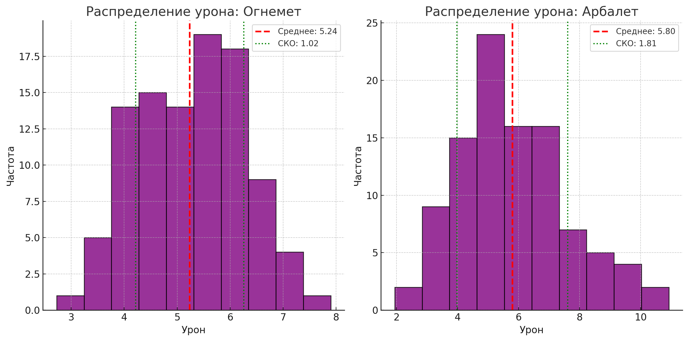
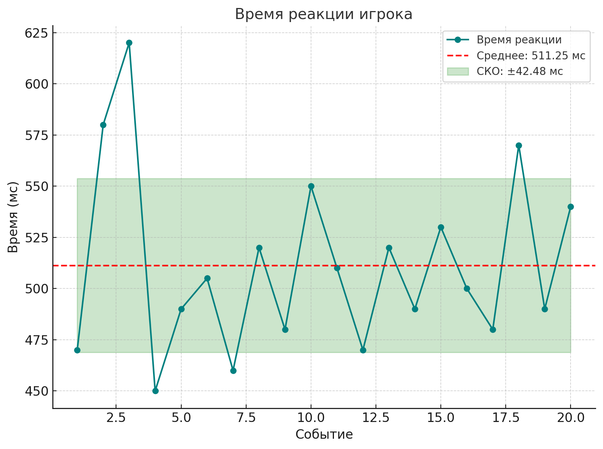
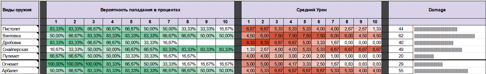
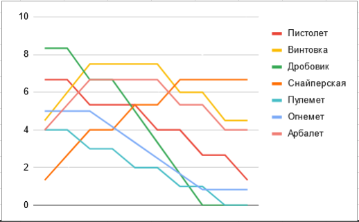

# АНАЛИЗ ДАННЫХ И ИСКУССТВЕННЫЙ ИНТЕЛЛЕКТ [in GameDev]
Отчет по лабораторной работе #3 выполнил(а):
- Шумов Никита Артёмович
- РИ232702

Отметка о выполнении заданий (заполняется студентом):

| Задание | Выполнение | Баллы |
| ------ | ------ | ------ |
| Задание 1 | * | 60 |
| Задание 2 | * | 20 |
| Задание 3 | * | 20 |

знак "*" - задание выполнено; знак "#" - задание не выполнено;

Работу проверили:
- к.т.н., доцент Денисов Д.В.
- к.э.н., доцент Панов М.А.
- ст. преп., Фадеев В.О.

Структура отчета

- Данные о работе: название работы, фио, группа, выполненные задания.
- Цель работы.
- Задание 1.
- Код реализации выполнения задания. Визуализация результатов выполнения (если применимо).
- Задание 2.
- Код реализации выполнения задания. Визуализация результатов выполнения (если применимо).
- Задание 3.
- Код реализации выполнения задания. Визуализация результатов выполнения (если применимо).
- Выводы.

## Цель работы

Разработать оптимальный баланс нанесения урона оружием для игры Save RTF

## Задание 1
### Расширьте варианты доступного оружия в игре. 

Используйте шаблон таблицы для визуализации оружия игры Save RTF.

### Ход работы:

Добавил два оружия огнемет и арбалет:

- Огнемет - это оружие ближнего боя, которое создает область поражения. Оно эффективно на коротких дистанциях, почти исключая промахи, но с увеличением расстояния точность и урон снижаются. Огнемет идеально подходит для борьбы с группами противников на малых дистанциях, благодаря способности наносить дополнительный урон от горения.
- Арбалет - точное оружие, особенно эффективное на средней дистанции. Он обладает высокой силой удара, способной пробивать броню противника или нескольких врагов одновременно. Однако точность арбалета заметно падает на больших дистанциях из-за траектории полета стрел.

## Задание 2
### Визуализируйте параметры оружия в таблице.Используйте шаблон таблицы для визуализации оружия игры Save RTF.

Используйте шаблон таблицы для визуализации оружия игры Save RTF. Постройте примеры для следующих математических величин (см. пример в презентации):
- Среднеквадратическое отклонение (СКО)
- Разброс урона оружия
- Вариативность времени отклика игрока (реакция на события)

### Ход работы:

- Рассчитать СКО.
- Рассчитать разброс урона.
- Рассчитать вариативность времени отклика игрока.

## Задание 3
### Визуализировать данные из google-таблицы, и с помощью Python передавать переменные в проект Unity. В Python данные также должны быть визуализированы.

### Ход работы:

...

## Выводы

1. Добавлены новые виды оружия (огнемет, арбалет):
    Огнемет эффективен против групп на близких дистанциях, арбалет — на средних. Это улучшает баланс и вариативность игры.

2. Проведен анализ параметров оружия:
    Рассчитаны СКО, разброс урона, вариативность реакции игрока, визуализированы данные.

3. Интеграция Python и Unity:
    Реализована передача и визуализация данных, что упростило тестирование.

Цель достигнута: баланс урона улучшен, инструменты анализа и оптимизации применены.
